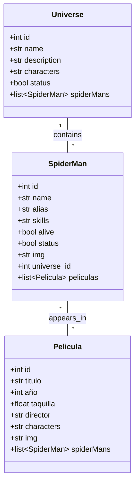
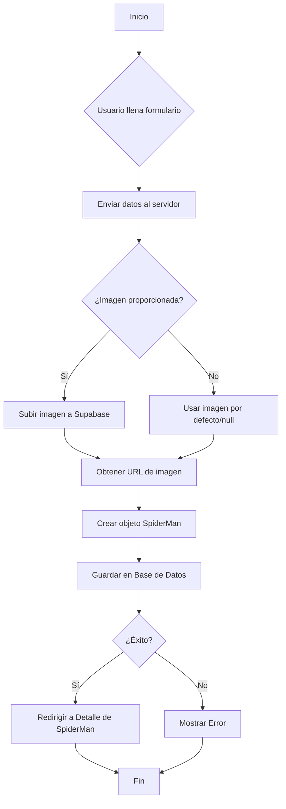

# 🕸️ Spider-Verse API & Manager

Bienvenido al **Spider-Verse API**, una aplicación web completa construida con **FastAPI** para gestionar el multiverso de Spider-Man. Esta herramienta permite administrar Universos, Spider-Mans y Películas, con una interfaz moderna y atractiva.


## 🚀 Características Principales

### 🌌 Gestión de Universos
- **Crear, Leer, Actualizar y Eliminar (Soft Delete)** universos.
- Visualización detallada de cada universo con sus personajes clave.
- Listado de Spider-Mans asociados a cada universo.

### 🕷️ Gestión de Spider-Mans
- Registro completo de Spider-Mans con nombre, alias, habilidades y estado (Vivo/Fallecido).
- **Carga de imágenes** integrada (alojadas en Supabase).
- Asignación automática a su universo de origen.
- Tarjetas de perfil con diseño moderno y badges de estado.

### 🎬 Gestión de Películas
- Catálogo de películas del Spider-Verse.
- Información detallada: Director, Año, Taquilla, Personajes.
- **Selección de Spider-Mans**: Vincula múltiples Spider-Mans a una película directamente desde el formulario de creación o edición.
- Carga de pósters de películas.

## 🛠️ Tecnologías Utilizadas

- **Backend:**
  - [FastAPI](https://fastapi.tiangolo.com/): Framework web moderno y de alto rendimiento.
  - [SQLModel](https://sqlmodel.tiangolo.com/): ORM para interactuar con la base de datos.
  - [Uvicorn](https://www.uvicorn.org/): Servidor ASGI.

- **Base de Datos:**
  - **PostgreSQL** (vía [Supabase](https://supabase.com/)): Almacenamiento de datos robusto y escalable.
  - **Supabase Storage**: Para el almacenamiento de imágenes de perfil y pósters.

- **Frontend:**
  - **Jinja2 Templates**: Motor de plantillas para renderizar HTML en el servidor.
  - **Bootstrap 5**: Framework CSS para un diseño responsivo y moderno.
  - **CSS Personalizado**: Tema oscuro "Spider-Verse" con efectos de neón y gradientes.

## 📦 Instalación y Configuración

1.  **Clonar el repositorio:**
    ```bash
    git clone <url-del-repositorio>
    cd <nombre-del-proyecto>
    ```

2.  **Crear un entorno virtual:**
    ```bash
    python -m venv .venv
    # En Windows:
    .venv\Scripts\activate
    # En macOS/Linux:
    source .venv/bin/activate
    ```

3.  **Instalar dependencias:**
    ```bash
    pip install -r requirements.txt
    ```

4.  **Configurar variables de entorno:**
    Crea un archivo `.env` en la raíz del proyecto con las credenciales de tu base de datos Supabase:
    ```env
    POSTGRESQL_ADDON_USER=tu_usuario
    POSTGRESQL_ADDON_PASSWORD=tu_contraseña
    POSTGRESQL_ADDON_HOST=tu_host
    POSTGRESQL_ADDON_PORT=tu_port
    POSTGRESQL_ADDON_DB=tu_base_de_datos
    SUPABASE_URL=tu_url_supabase
    SUPABASE_KEY=tu_key_supabase
    ```
    Url del bucket y dataBase de SupaBase: https://supabase.com/dashboard/project/uiiszifzqbwhffrcryeo/editor/25245

5.  **Ejecutar la aplicación:**
    ```bash
    uvicorn main:app --reload
    ```
    O tambien inicia tu servidor, en mi caso render.
    https://dashboard.render.com/web/srv-d4ojnkqdbo4c73f556ag/deploys/dep-d4ojnl2dbo4c73f556i0

6.  **Acceder a la aplicación:**
    Abre tu navegador y visita `http://127.0.0.1:8000`.
    O tambien accede a la url: https://spiderverse-api-ray8.onrender.com

## 📂 Estructura del Proyecto

- `main.py`: Punto de entrada de la aplicación FastAPI.
- `models.py`: Definición de modelos de datos (Tablas SQL).
- `db.py`: Configuración de la conexión a la base de datos.
- `pelicula.py`, `Spiderman.py`, `universe.py`: Rutas y lógica para cada entidad.
- `TemplatesHTML/`: Plantillas HTML (Jinja2).
- `estilos/`: Archivos CSS y recursos estáticos.
- `SupaBase/`: Lógica de conexión con Supabase Storage.

## 📘 Documentación Técnica

### 📊 Diagrama de Clases
A continuación se presenta el diagrama de clases que representa las entidades principales del sistema y sus relaciones.



### 🔄 Diagrama de Actividades (Crear Spider-Man)
Flujo de proceso para la creación de un nuevo Spider-Man en el sistema.



### 🗂️ Modelos de Datos

#### Universe
Representa un universo alternativo en el multiverso.
- **name**: Nombre del universo (ej. Earth-616).
- **description**: Breve descripción del universo.
- **characters**: Personajes principales o notas.
- **status**: Estado del registro (Activo/Eliminado).

#### SpiderMan
Representa a una variante de Spider-Man.
- **name**: Nombre real (ej. Peter Parker).
- **alias**: Nombre de superhéroe (ej. Spider-Man).
- **skills**: Habilidades destacadas.
- **alive**: Estado vital (Vivo/Fallecido).
- **img**: URL de la imagen de perfil.
- **universe_id**: ID del universo al que pertenece.

#### Pelicula
Representa una película del Spider-Verse.
- **titulo**: Título de la película.
- **año**: Año de lanzamiento.
- **taquilla**: Recaudación en taquilla.
- **director**: Director de la película.
- **img**: URL del póster.

### 🔌 Endpoints API

#### Spider-Mans (`/SpiderMans`)
| Método | Ruta | Descripción |
| :--- | :--- | :--- |
| `GET` | `/` | Lista todos los Spider-Mans activos. |
| `GET` | `/{id}` | Obtiene detalles de un Spider-Man. |
| `POST` | `/` | Crea un nuevo Spider-Man. |
| `GET` | `/{id}/edit` | Formulario de edición. |
| `POST` | `/{id}/update` | Actualiza un Spider-Man. |
| `POST` | `/{id}/delete` | Realiza un soft-delete. |

#### Universes (`/universes`)
| Método | Ruta | Descripción |
| :--- | :--- | :--- |
| `GET` | `/` | Lista todos los universos. |
| `GET` | `/{id}` | Obtiene detalles de un universo. |
| `POST` | `/` | Crea un nuevo universo. |
| `GET` | `/{id}/spiderMans` | Lista Spider-Mans de un universo. |
| `POST` | `/{id}/delete` | Realiza un soft-delete. |

#### Peliculas (`/peliculas`)
| Método | Ruta | Descripción |
| :--- | :--- | :--- |
| `GET` | `/` | Lista todas las películas. |
| `GET` | `/{id}` | Obtiene detalles de una película. |
| `POST` | `/` | Crea una nueva película. |
| `POST` | `/{id}/add-spiderman` | Vincula un Spider-Man a una película. |
| `POST` | `/{id}/remove-spiderman/{sid}` | Desvincula un Spider-Man de una película. |

---
Desarrollado con 🕸️ y ❤️ para el Spider-Verse.
